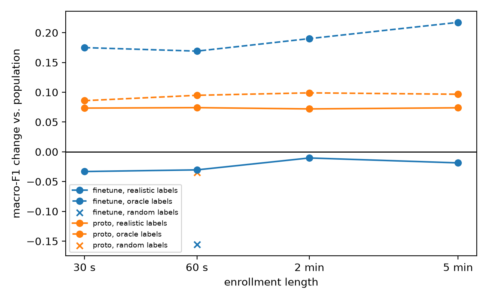
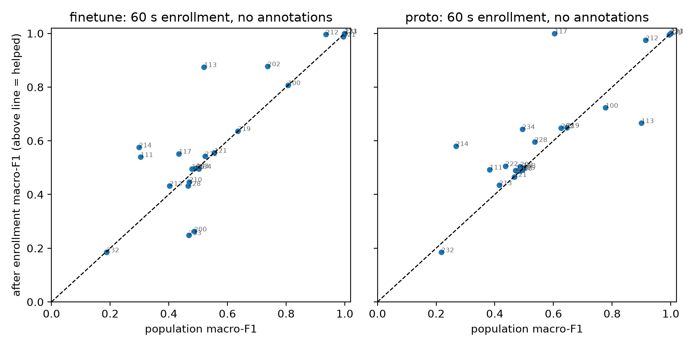

# On-Device Personalized ECG Classifier

A heartbeat classifier trained on other people's hearts does worse on a new person's heart.
This project measures that gap on MIT-BIH with a proper inter-patient split, then tests whether a
short per-patient enrollment, using no cardiologist labels, closes part of it. The model is
converted to Core ML so the enrollment can run on an iPhone.

**Research prototype, not a medical device.**

Status: v1 (Python result + Core ML parity) done. Swift prototype head done and matches Python.
v2 (iPhone latency, compressed re-run) in progress.

## The leakage trap

If you split MIT-BIH beats at random, the same patient ends up in train and test and you score
around 99%. That number measures memorizing patients, not generalizing. Here the split is the
de Chazal inter-patient one: DS1 records train, DS2 records test, no record in both. Paced records
(102, 104, 107, 217) are left out. The numbers below are lower than the random-split ones you see
around, and that's expected.

## Setup

- MIT-BIH Arrhythmia Database, lead MLII, 360 Hz, AAMI classes N / S / V / F / Q.
- Baseline wander removed with 200 ms + 600 ms median filters.
- 256-sample window per beat (R peak at index 100), z-scored per beat.
- 4 RR features per beat: pre-RR, post-RR, mean RR of the last 10 beats, pre / local ratio.
  These go into the model. S beats are mostly told apart by timing, not shape.
- Model: 4 conv blocks → global average pool → 64-d embedding, then one linear layer on
  [embedding, RR]. Weighted cross-entropy (1/√count).
- Epoch picked on 4 held-out DS1 patients (106, 118, 124, 223). DS2 is never used to choose anything.
- Metric: macro-F1 over N, S, V, F (Q has 7 beats in DS2), plus per-class sensitivity and PPV.

```
python prep.py      # download + preprocess
python train.py     # Step A
python enroll.py    # Step B
python convert.py   # Core ML (macOS)
```

## Step A: the gap

Population model on all DS2 beats. **Macro-F1 0.407.**

| Class | Sens | PPV | Beats |
|---|---|---|---|
| N | 0.832 | 0.957 | 44218 |
| S | 0.084 | 0.039 | 1836 |
| V | 0.856 | 0.571 | 3219 |
| F | 0.005 | 0.001 | 388 |

S is the weak class. Record 232 holds 1381 of the 1836 DS2 S beats, and the model gets almost
none of them (1013 go to N, 363 to V), even though their RR ratio is clearly short (median 0.74
vs 1.76 for that record's N beats). Leaving 232 out, S sensitivity is 0.327.

## Step B: enrollment

For each DS2 patient, enroll on the first 30 s / 60 s / 2 min / 5 min, and test on every beat
after 5 min. The test beats are the same for every length, and enrollment beats never touch them.

Two methods, backbone frozen in both:
- **Fine-tune:** plain SGD on the linear head only (what `MLUpdateTask` can do on device).
- **Prototype head:** class prototypes = class means of [embedding, RR] on DS1 train, scaled by
  DS1 std. Enrollment blends the prototypes toward the patient's mean with weight α, then
  classify by nearest prototype. α picked on DS1 val patients (0.5).

Two label conditions:
- **Realistic:** every enrollment beat labeled N, since a phone gets no annotations. This is the
  headline.
- **Oracle:** true MIT-BIH labels. Upper bound.

Control: random labels at 60 s. It should not help, and it doesn't.

**Recovered share = (enrolled − population) / (oracle 5 min − population)**, on pooled macro-F1,
with each method's own baseline and ceiling.

| Condition (60 s) | Macro-F1 | Change | V sens | S sens | Recovered |
|---|---|---|---|---|---|
| Prototype, population | 0.402 | | 0.908 | 0.084 | |
| Prototype, realistic | 0.476 | **+0.074** | 0.874 | 0.057 | 77% |
| Prototype, oracle 5 min (ceiling) | 0.499 | +0.097 | 0.945 | 0.139 | 100% |
| Fine-tune, population | 0.411 | | 0.853 | 0.094 | |
| Fine-tune, realistic | 0.380 | −0.030 | 0.350 | 0.054 | −14% |
| Fine-tune, oracle 5 min (ceiling) | 0.628 | +0.217 | 0.835 | 0.646 | 100% |
| Fine-tune, random labels | 0.255 | −0.156 | 0.810 | 0.172 | |
| Prototype, random labels | 0.368 | −0.034 | 0.895 | 0.138 | |





## What surprised me

- **Label-free enrollment helps the prototype head and hurts fine-tuning.** Fine-tuning on
  all-N labels teaches the head to call everything N, and V sensitivity falls from 0.85 to 0.35.
  Moving only the N prototype doesn't have that problem.
- **The prototype gain is fewer false alarms, not more arrhythmias found.** V PPV goes from 0.50 to
  0.89, and S sensitivity actually drops a bit. The 77% is of a small ceiling (+0.097), so +0.074
  macro-F1 is the more honest number.
- **The prototype curve is flat from 30 s to 5 min.** 30 seconds of beats already gives the N mean.
- **One record drives the fine-tune ceiling.** Without 232, the oracle fine-tune S sensitivity is
  0.197, below the population model's 0.331. Most of the oracle's S gain is learning 232.

## Core ML

- FP32 ML Program vs PyTorch on all DS2 beats: max logit difference 1.3e-5, argmax agreement 100%.
- Embedding model for the phone: FP16 61.4 KB, 6-bit palettized 31.7 KB.

## Swift prototype head

`swift/ProtoHead` is a Swift package with the on-device part: `EmbeddingModel` runs the Core ML
embedding model one beat at a time, and `ProtoHead` appends the 4 RR values, does the at-rest
enrollment (N prototype blended toward the enrollment mean) and classifies by nearest prototype.
The `replay` tool feeds it a MIT-BIH record exported by `replay.py`, so this is a **replayed**
record, not a live sensor.

```
python replay.py export --rec 214
swift build -c release --package-path swift/ProtoHead
swift/ProtoHead/.build/release/replay runs/replay/214.json runs/coreml/ecg_embedding_fp16.mlpackage \
    runs/enroll/proto_constants.json runs/replay/214_swift.json
python replay.py check --rec 214
```

Checked on all 22 DS2 records (FP16 model, CPU, on a Mac):
- Swift embeddings = coremltools embeddings exactly.
- Swift head vs Python head on the same embeddings: 100% same predictions.
- End to end vs the PyTorch path in `enroll.py`: 10 of 41,459 test beats differ (FP16 rounding),
  per-record macro-F1 within 0.001.

On the iPhone (`ios/ECGReplay`, a one-button app using the same package, record 214 bundled
in the app):
- CPU only: `replay.py check` on the phone's saved output gives the same three results as the Mac
  (embeddings identical, head 100%, 1 beat off from PyTorch).
- All compute units: same per-class results as the Mac (N 1613/1662, V 156/212). Enrollment,
  76 beats (60 s) embedded + N prototype update: **6.3 ms**. Model load 127 ms, about 0.07 ms per beat. Full latency benchmark per compute unit still to do.

## What broke

- PhysioNet returned a 502 halfway through the download, and the prep script only checked for one
  file, so a rerun skipped the download and crashed. Now it checks all records.
- 6-bit palettization needs scikit-learn (k-means), which wasn't in the requirements.

## Prior work

This is not a new idea. Patient-specific ECG classification is well studied; the contribution
here is doing it carefully and running it on-device.

- P. de Chazal, M. O'Dwyer, R. B. Reilly. *Automatic classification of heartbeats using ECG
  morphology and heartbeat interval features.* IEEE TBME 51(7), 2004. (the inter-patient split)
- S. Kiranyaz, T. Ince, M. Gabbouj. *Real-time patient-specific ECG classification by 1-D
  convolutional neural networks.* IEEE TBME 63(3), 2016. (patient-specific 1D CNN, first 5 min
  of each record)
